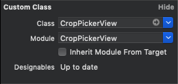
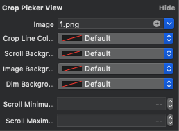

# CropPickerView

[](https://cocoapods.org/pods/CropPickerView)
[](https://cocoapods.org/pods/CropPickerView)
[](https://cocoapods.org/pods/CropPickerView)
[](https://developer.apple.com/swift/)

## Introduce

The Corner and Side buttons allow you to modify the position of the crop and UIScrollView to zoom the image. If the image is larger than the area of the UIScrollView, the image can be scrolled up and down, left and right, and if the image is smaller than the area of the UIScrollView, the image is always centered.

### [CropPickerController](https://github.com/pikachu987/CropPickerController)

If you want to see the CropPickerViewController that is created with CropView, see [CropPickerController](https://github.com/pikachu987/CropPickerController)

<br/>

### CropPickerView


## Requirements

`CropPickerView` written in Swift 5.0. Compatible with iOS 8.0+

## Installation

CropPickerView is available through [CocoaPods](https://cocoapods.org). To install
it, simply add the following line to your Podfile:

```ruby
pod 'CropPickerView'
```

## Usage


### Xib or Storyboard file

setting





done!

<br><br><br>

### Code editor

```swift
import CropPickerView
```

```swift
let cropPickerView = CropPickerView()
self.view.addSubview(cropPickerView)
```

done!

<br><br><br>


### Property

image

```swift

cropPickerView.image = UIImage(named: "")

```

color

```swift

cropPickerView.cropLineColor = UIColor.gray
cropPickerView.scrollBackgroundColor = UIColor.gray
cropPickerView.imageBackgroundColor = UIColor.gray
cropPickerView.dimBackgroundColor = UIColor(white: 0, alpha: 0.1)

```

zoom

```swift

cropPickerView.scrollMinimumZoomScale = 1
cropPickerView.scrollMaximumZoomScale = 2

```

<br><br>

### Method

crop

```swift

cropPickerView.crop { (error, image) in
    if let error = (error as NSError?) {
        let alertController = UIAlertController(title: "Error", message: error.domain, preferredStyle: .alert)
        alertController.addAction(UIAlertAction(title: "Ok", style: .cancel, handler: nil))
        self.present(alertController, animated: true, completion: nil)
        return
    }
    self.imageView.image = image
}

```

<br><br>

### Delegate

```swift

class ViewController: UIViewController{
    override func viewDidLoad() {
        super.viewDidLoad()

        let cropPickerView = CropPickerView()
        cropPickerView.delegate = self
    }
}

// MARK: CropPickerViewDelegate
extension ViewController: CropPickerViewDelegate {
    func cropPickerView(_ cropPickerView: CropPickerView, error: Error) {

    }
    func cropPickerView(_ cropPickerView: CropPickerView, image: UIImage) {

    }
}

```


## Author

pikachu987, pikachu77769@gmail.com

## License

CropPickerView is available under the MIT license. See the LICENSE file for more info.
